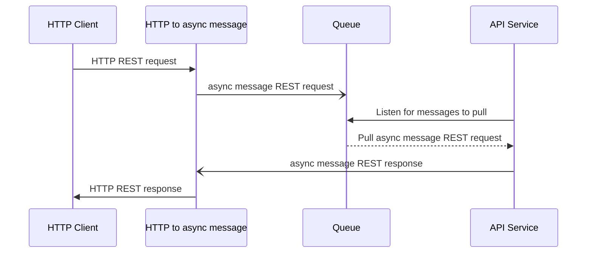
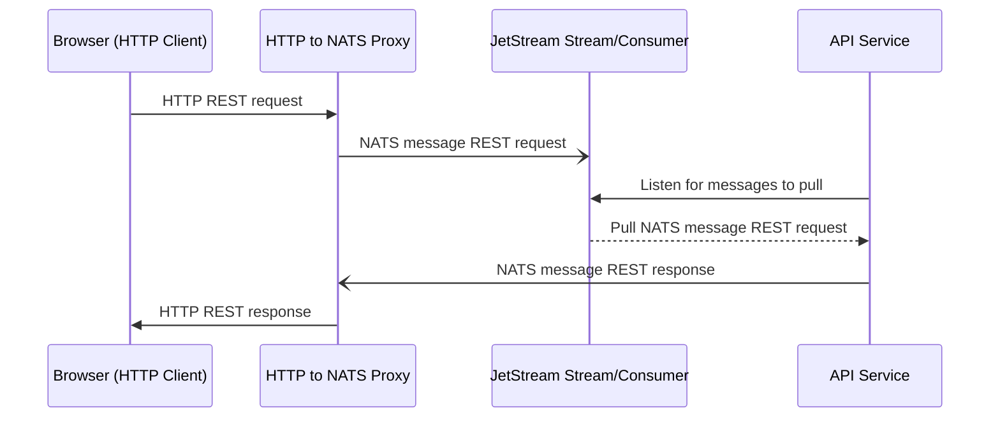

# Introduction

The backend and infrastructure for a prototype full-stack C#, Preact web
application deployed on Azure AKS using modern tools. This project primarily
focuses on architectural design, implementation, and tools that can be leveraged
for enterprise-grade applications.

The frontend repository lives here: https://github.com/CodingFlow/rating-app

Tools and frameworks used:

- [Azure AKS](https://azure.microsoft.com/en-us/products/kubernetes-service) -
  Managed Kubernetes service on Azure.
- [Devbox](https://www.jetify.com/devbox) - Ergonomic tool over
  [Nix](https://nixos.org/) to enable easily creating portable, isolated
  development environments.
- [Docker](https://www.docker.com/) - Container tool chain.
- [Preact](https://preactjs.com/) - lightweight, high-performance alternative to
  React.
- [Nats](https://nats.io/) - Distributed, asynchronous messaging system designed
  for performance, scalability, and ease of use.
- [JetStream](https://docs.nats.io/nats-concepts/jetstream) - NATS message
  persistence engine that allows messages to be stored and replayed at a later
  time.
- [k3d](https://k3d.io/stable/) - Local Kubernetes toolchain for local
  development.
- [k6](https://k6.io/) - Performance testing tool.

# Architectural Design

## Conceptual Design

The main idea is to have a service pull architecture: microservices pull from
queues and communcate using an asynchronous, distributed messaging system via
publish/subscribe.



### HTTP To Async Message

Since all services communicate only through the asynchronous messaging system, a
proxy to convert HTTP requests to async messages is needed to service external
HTTP client requests. To the client, the API appears no different than any other
REST API.

### Pull Services

By pulling from a queue, load balancing can be more efficienct and offer better
service quality. Since service instances will only pull more work if they are
able to handle it, no unserviceable requests will be sent to a service instance
that can't handle it.

For example, a traditional round-robin load balancing could send many heavy
requests to the same instance. Eventually, that instance will reach its maximum
request handling capacity much sooner compared to the other instances. Auto
scaling might not even trigger if it is based on the average cpu/memory
utilization across instances. Yet, the at-capacity instance will continue to
receive requests it cannot service. By using a pull system, the less burdened
instances will service the requests instead, ensuring all requests are serviced.

### Asynchronous Communication

By leveraging an asynchronous messaging system with durable message queues,
service quality features, e.g. retries, can be handled separately from the
applications without resorting to more complex solutions such as side car
applications or a service mesh.

Another feature of asynchronous communication is the ability for _different_
service instances to receive request responses. If the original requesting
service becomes unavailable after sending a request, a different instance can
receive and process the response of the request.

## Concrete Design

Following the conceptual design, the concrete design uses specific frameworks
and tools.



# Usage

[Install Devbox](https://www.jetify.com/docs/devbox/installing_devbox/). On
Windows, install WSL2 as a prerequisite as mentioned in the
[installation instructions](https://www.jetify.com/docs/devbox/installing_devbox/?install-method=wsl).

Start the Devbox environment (in WSL shell for Windows) at the root of the
project:

```bash
devbox shell
```

Scripts for creating a local Kubernetes cluster using k3d and to deploy various
components to the cluster are available as shell aliases for convenience:

| Command                     | Description                                                                                                                    |
| --------------------------- | ------------------------------------------------------------------------------------------------------------------------------ |
| `load_config`               | Load either `dev` (development) or `prod` (production) environment variables to be used for the other deployment commands.     |
| `create-cluster`            | Creates local k3d cluster with local docker registry. Installs [k8sGateway](https://k8sgateway.io/), NATS, and NATS JetStream. |
| `start-cluster`             | Starts k3d cluster if it is stopped.                                                                                           |
| `stop-cluster`              | Stop k3d cluster.                                                                                                              |
| `delete-cluster`            | Deletes the k3d cluster.                                                                                                       |
| `deploy-nack`               | Apply JetStream kubernetes configuration.                                                                                      |
| `deploy-gateway`            | Apply k8sGateway kubernetes configurations.                                                                                    |
| `deploy-http-to-nats-proxy` | Build and push to docker registry the docker image for http-to-nats-proxy and deploy via kubernetes configuration.             |
| `deploy-service`            | Build and push to docker registry the docker image for rating-service and deploy via kubernetes configuration.                 |
| `deploy-frontend`           | Build and push to docker registry the docker image for the frontend and deploy via kubernetes configuration.                   |
| `port-forward-gateway`      | Port forward the gateway to localhost so the frontend and backend can be accessed for testing.                                 |

Devbox is set up to run `load_config dev` on starting a devbox environment e.g.
via `devbox shell`.

For first time setup, create the cluster, deploy everything, then port forward
for testing:

```bash
create-cluster
deploy-nack
deploy-service
deploy-http-to-nats-proxy
deploy-gateway
deploy-frontend
port-forward-gateway
```

Then a request to http://localhost:8080/api/users to get users from the API. Or
access http://localhost:8080/ui in the browser.
