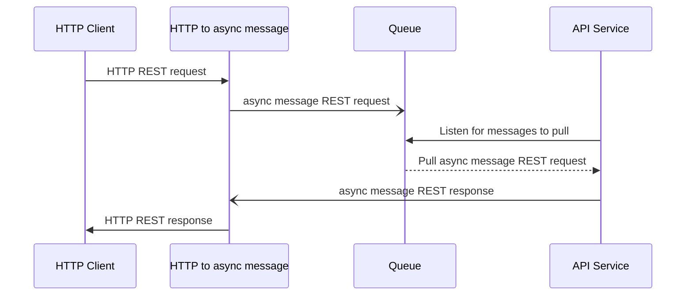
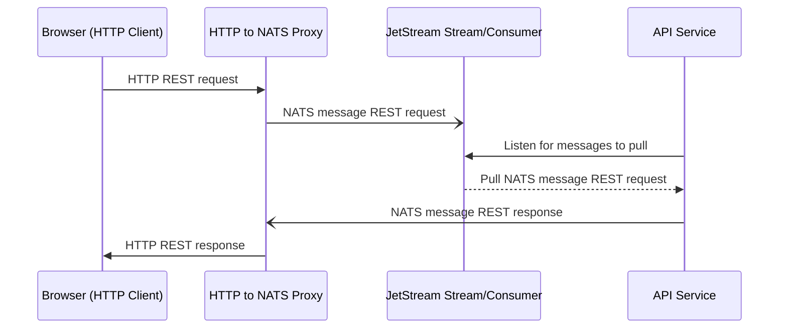
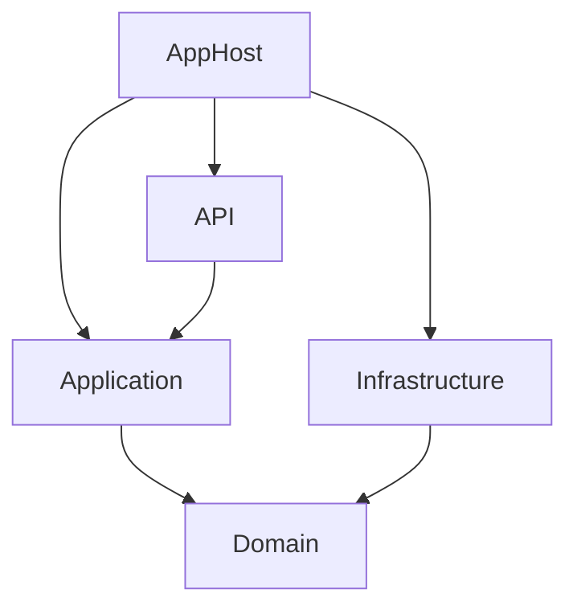

# Introduction

The backend and infrastructure for a prototype full-stack C#, Preact web
application deployed on Azure AKS using modern tools. This project primarily
focuses on architectural design, implementation, and tools that can be leveraged for enterprise-grade applications.

The frontend repository lives here: https://github.com/CodingFlow/rating-app

The http-to-nats proxy lives here:
https://github.com/CodingFlow/http-to-nats-proxy

Tools and frameworks used by backend and infrastructure:

- [Azure AKS](https://azure.microsoft.com/en-us/products/kubernetes-service) -
  Managed Kubernetes service on Azure.
- [Devbox](https://www.jetify.com/devbox) - Ergonomic tool over
  [Nix](https://nixos.org/) to enable easily creating portable, isolated
  development environments.
- [Docker](https://www.docker.com/) - Container tool chain.
- [Preact](https://preactjs.com/) - lightweight, high-performance alternative to
  React.
- [Nats](https://nats.io/) - Distributed, asynchronous messaging system designed
  for performance, scalability, and ease of use.
- [JetStream](https://docs.nats.io/nats-concepts/jetstream) - NATS message
  persistence engine that allows messages to be stored and replayed at a later
  time.
- [Redis](https://redis.io/) - High performance in-memory distributed cache.
- [SigNoz](https://signoz.io/) - Observability platform for collecting and viewing logs, traces, and metrics.
- [k3d](https://k3d.io/stable/) - Local Kubernetes toolchain for local
  development.
- [k9s](https://k9scli.io/) - Terminal based UI to interact with Kubernetes clusters.
- [k6](https://k6.io/) - Performance testing tool.

# Architectural Design

Definitions:

**Conceptual**: High level, not very technical, business domain level.

**Logical**: Technical, agnostic of particular techlibraries and frameworks.

**Physical/Concrete**: More detailed, uses specific technologies.

([Reference](https://medium.com/@nolomokgosi/conceptual-logical-and-physical-design-c24100846931))

## Logical Design

The main idea is to have a service pull architecture: microservices pull from
queues and communcate using an asynchronous, distributed messaging system via
publish/subscribe.



### HTTP To Async Message

Since all services communicate only through the asynchronous messaging system, a
proxy to convert HTTP requests to async messages is needed to service external
HTTP client requests. To the client, the API appears no different than any other
REST API.

### Pull Services

By pulling from a queue, load balancing can be more efficienct and offer better
service quality. Since service instances will only pull more work if they are
able to handle it, no unserviceable requests will be sent to a service instance
that can't handle it.

For example, a traditional round-robin load balancing could send many heavy
requests to the same instance. Eventually, that instance will reach its maximum
request handling capacity much sooner compared to the other instances. Auto
scaling might not even trigger if it is based on the average cpu/memory
utilization across instances. Yet, the at-capacity instance will continue to
receive requests it cannot service. By using a pull system, the less burdened
instances will service the requests instead, ensuring all requests are serviced.

### Asynchronous Communication

By leveraging an asynchronous messaging system with durable message queues,
service quality features, e.g. retries, can be handled separately from the
applications without resorting to more complex solutions such as side car
applications or a service mesh.

Another feature of asynchronous communication is the ability for _different_
service instances to receive request responses. If the original requesting
service becomes unavailable after sending a request, a different instance can
receive and process the response of the request.

## Concrete Design

Following the conceptual design, the concrete design uses specific frameworks
and tools.



## Service Design

- Generally follow the ideas and guidelines for Domain Driven Design from the free book **.NET Microservices: Architecture for Containerized .NET Applications** ([view online](https://learn.microsoft.com/en-us/dotnet/architecture/microservices/))
- Focus on opinionated shared libraries, code generators, and tools to enable standardization, reduce boilerplate, and ease improvements across all services.

### Service Layers

Services will be composed of the following five layers:

- AppHost
- API
- Application
- Infrastructure
- Domain

Also there is a `Infrastructure.DesignTime` project which is not a runtime layer, but a supporting design time project for the infrastructure layer.

The following diagram shows the layer dependencies:



Notice that `Domain` depends on no other layer and that `Application` does not directly depend on `Infrastructure`. `Domain` is the final layer and the core of the application. `Application` indirectly receives dependencies from `Infrastructure` through `AppHost` using dependency injection.

#### AppHost Layer

The application composition root and host for the entire application. Responsible for:

- Hosting and starting the main application logic.
- Setting up dependency injection.
- Setting up configuration.

A common library has been created to set up the preceding items: `Service.AppHost.Common`.

#### API Layer

The frontend of the service, the API layer contains the technical infrastructure to accept and deserialize requests and serialize responses back to consumers. This includes:

- Connecting to a NATS server.
- Dispatching request queries/commands to the right handler in the Application layer.

A common library has been created to set up the preceding items: `Service.Api.Common`.

The API layer will follow an API-first approach instead of a code-first approach for the following reasons:

- There will be code generation opportunities regardless of approach.
- Code-first means creating a specification using code. Code is not the most ideal format for creating declarative specification. AsyncAPI specifications were made for it.

 Code generation is used to create the needed code from the API specification, [AsyncAPI spec](https://www.asyncapi.com). The common source generator, `AsyncApiBindingsGenerator`, will be used across all services' API layers for this purpose. A useful tool for editing and validating in real time AsyncAPI spec files is [AsyncAPI Studio](https://studio.asyncapi.com/).

#### Application Layer

Handles queries and commands from the API layer by orchestrating between the domain and infrastructure layers.

The code generator, `AsyncApiApplicationSupportGenerator`, generates:

- The handler interfaces from the AsyncApi spec for each operation defined.
- All types for query, command, query response, command response, and their nested types.

The handler interfaces are derived from a generic interface with types specified for the request and response types that must be handled. In practical terms, it gives a convenient way to create the concrete handler class with the right method types by using [Visual Studio's "Implement interface" code generation quick action](https://learn.microsoft.com/en-us/visualstudio/ide/reference/implement-interface?view=visualstudio).

#### Infrastructure Layer

Contains implementations of repositories that implement the interfaces from the domain layer. Repositories provide an abstraction to database-related logic. Repositories use [Entity Framework Core](https://learn.microsoft.com/en-us/ef/core/) `DBContext`s to interact with the service's database.

#### Domain Layer

The core of the service. All business/domain logic resides here following DDD best practices. Aggregates, entities, value objects, as well as repository interfaces reside in this layer. Repository implementations are not present so only the abstractions are exposed to the application layer.

#### Infrastructure.DesignTime Project

Contains Entity Framework Core design time support code for the `DBContext`s in the infrastructure layer, such as for generating database migration code and performing migrations.

### Shared Service Libraries

#### Common Libraries

Common libraries named `Service.*.Common` are always used across all services. This makes it easy to make improvements and enforce best practices across all services. The `*` is the service layer the library contains common code for and also the layer it must be installed in:

| Library                       | Layer                         |
| ----------------------------- | ----------------------------- |
| Service.AppHost.Common        | {Service Name}.AppHost        |
| Service.Api.Common            | {Service Name}.Api            |
| Service.Application.Common    | {Service Name}.Application    |
| Service.Infrastructure.Common | {Service Name}.Infrastructure |
| Service.Domain.Common         | {Service Name}.Domain         |

For example, for a service called `RatingService`, the common library that must be installed in the API layer, `RatingService.Api`, is `Service.Api.Common`.

#### Feature Libraries

Feature libraries, named `Service.*.Feature.*`, are for reusable functionality that is needed by some, but not all, services. For example, Redis caching. The first `*` is the service layer and the second `*` is the name of the feature:

| Library                                       | Layer                         |
| --------------------------------------------- | ----------------------------- |
| Service.AppHost.Feature.{Feature Name}        | {Service Name}.AppHost        |
| Service.Api.Feature.{Feature Name}            | {Service Name}.Api            |
| Service.Application.Feature.{Feature Name}    | {Service Name}.Application    |
| Service.Infrastructure.Feature.{Feature Name} | {Service Name}.Infrastructure |
| Service.Domain.Feature.{Feature Name}         | {Service Name}.Domain         |

For example, if there is a reusable Redis caching logic, it can be called `Service.Infrastructure.Feature.Redis` and can only be installed in the infrastructure layer. For a service called `RatingService`, it can only be installed in the `RatingService.Infrastructure` layer.

### Validation and Null Handling

Validation, including handling null values, will be handled as early as possible. Null handling will always be handled at the periphery of the service, either throwing an exception or using the [null object pattern](https://en.wikipedia.org/wiki/Null_object_pattern). The reason why nulls are minimized is:

Propagating the use of nullable types in a codebase vastly increases [cyclomatic complexity](https://en.wikipedia.org/wiki/Cyclomatic_complexity) due to the added code branches to handle the case when the type is null. Besides increasing cognitive load and uncertainty, the work required for tests to cover all code paths increases exponentially.

### Dependency Injection Registrations

Dependency injection registration code will have no logic and focus purely on the sole responsibility of registering dependencies (applying the [single responsiblity principle](https://en.wikipedia.org/wiki/Single-responsibility_principle)). Any configuration or setup code should be contained in a type that is then registered with the DI container. If the logic is only a more complex registration, it can be extracted into a common extension method or source generator that can be independently tested.

Following this practice is beneficial since DI registrations do not need traditional unit tests, so it can safely be excluded from code coverage, and can rely instead on validating the dependency graph in a "unit test".

#### Examples

Don't Do:

```csharp
services.AddDbContext<ApplicationDbContext>(options =>
    options.UseSqlServer(builder.Configuration.GetConnectionString("DefaultConnection")));
```

Do:

```csharp
services.AddOptionsBindings(configuration);
services.AddDBContext<ApplicationDbContext>();
```

And specify configuration in the options class:

```csharp
using System.ComponentModel.DataAnnotations;
using CodingFlow.OptionsBindingsGenerator;
using Microsoft.Extensions.Configuration;

namespace RatingService.Infrastructure;

[OptionsBindings(true, "ConnectionStrings")]
internal record ApplicationDbContext
{
    [Required]
    [ConfigurationKeyName("DefaultConnection")]
    public required string ConnectionString { get; set; }
}
```

# Usage

[Install Devbox](https://www.jetify.com/docs/devbox/installing_devbox/). On
Windows, install WSL2 as a prerequisite as mentioned in the
[installation instructions](https://www.jetify.com/docs/devbox/installing_devbox/?install-method=wsl).

Start the Devbox environment (in WSL shell for Windows) at the root of the
project:

```bash
devbox shell
```

> [!NOTE]
> if you encounter an error with docker, "Cannot connect to the Docker daemon at unix:///var/run/docker.sock. Is the docker daemon running?", Then the workaround is to, unfortunately, install Docker on your machine (or in WSL if on Windows). A [GitHub issue](https://github.com/jetify-com/devbox/issues/2485) has been created with DevBox, but no solutions or workarounds have been proposed.

Scripts for creating a local Kubernetes cluster using k3d and to deploy various
components to the cluster are available as shell aliases for convenience:

| Command                       | Description                                                                                                                     |
| ----------------------------- | ------------------------------------------------------------------------------------------------------------------------------- |
| `load_config`                 | Load either `dev` (development) or `prod` (production) environment variables to be used for the other deployment commands.      |
| `create-cluster`              | Creates local k3d cluster with local docker registry. Installs [k8sGateway](https://k8sgateway.io/), NATS, and NATS JetStream.  |
| `start-cluster`               | Starts k3d cluster if it is stopped.                                                                                            |
| `stop-cluster`                | Stop k3d cluster.                                                                                                               |
| `delete-cluster`              | Deletes the k3d cluster.                                                                                                        |
| `deploy-nack`                 | Apply JetStream kubernetes configuration.                                                                                       |
| `deploy-gateway`              | Apply k8sGateway kubernetes configurations.                                                                                     |
| `deploy-signoz`               | Apply SigNoz kubernetes configurations                                                                                          |
| `deploy-http-to-nats-proxy`   | Build and push to docker registry the docker image for http-to-nats-proxy and deploy via kubernetes configuration.              |
| `deploy_database`             | Installs Cloudnative-pg and apply Postgresql kubernetes configuration                                                           |
| `deploy_redis `               | Build and push to docker registry the docker image for rating-service's Redis instance and deploy via kubernetes configuration. |
| `deploy-service`              | Build and push to docker registry the docker image for rating-service and deploy via kubernetes configuration.                  |
| `deploy-frontend`             | Build and push to docker registry the docker image for the frontend and deploy via kubernetes configuration.                    |
| `port-forward-gateway`        | Port forward the gateway to localhost so the frontend and backend can be accessed for testing.                                  |
| `port-forward-signoz`         | Port forward the SigNoz UI to localhost so it can be accessed via the browser.                                                  |
| `create-local-nuget-packages` | Create local nuget packages for local libraries used by the service.                                                            |
| `create-database-migration`   | Creates database migration files via Entity Framework Core.                                                                     |
| `update-database`             | Executes database migration using database migration files via kubernetes job.                                                  |
| `update-redis`                | Updates rating-service's Redis instance with schema and indexes via kubernetes job.                                             |

Devbox is set up to run `load_config dev` on starting a devbox environment e.g.
via `devbox shell`.

For first time setup, create the cluster, deploy everything, then port forward
for testing:

```bash
create-cluster
deploy-nack
deploy-database
update-database
deploy-redis
update-redis
deploy-signoz
deploy-service
deploy-http-to-nats-proxy
deploy-gateway
deploy-frontend
port-forward-gateway
```

Go to the SigNoz UI at http://localhost:3301 and create an account, otherwise Signoz will be unable to collect any telemetry.

Then populate the database with some data by sending a `POST` request to http://localhost:8080/api/ratings with a body:

```json
{
    "items": [
        {
            "userId": "019b82d7-1476-711b-8bf1-0d963f31def4",
            "serviceId": "019b82d7-1476-711b-8bf1-0d963f31def4",
            "score": 5
        }
    ]
}
```

Finally, view the data by sending a `GET` request to http://localhost:8080/api/ratings to get ratings from the API. Or
access http://localhost:8080/ui in the browser.

View logs and tracing information in the SigNOz UI via a browser at http://localhost:3301.

You can run the performance test script using k6:

```bash
k6 run performance-test.js
```

You may want to reduce the tracing sampling rate for the rating-service to reduce the load on your system from aggregating a lot of traces in SigNoz. You can change in the file deployment/app/templates/app.yaml the environment variable `OTEL_TRACES_SAMPLER_ARG` from 1.0 to something like 0.1.

